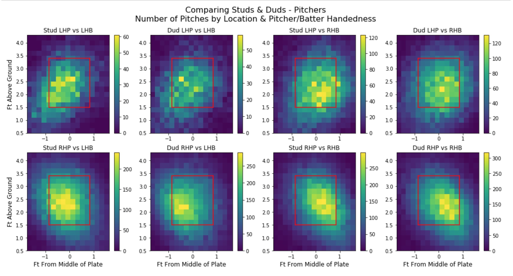
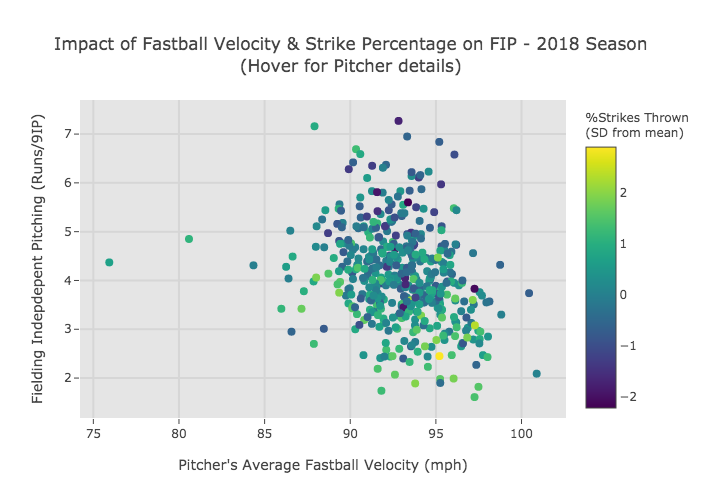
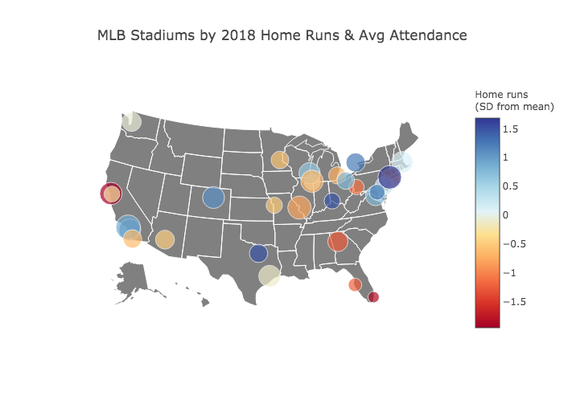

# MLB Pitch Data Visualization
*Final Project for MSDS 622 (Data Visualization)*

Select plots:

[Link to interactive version](https://plot.ly/~ecalkins/102/impact-of-fastball-velocity-strike-percentage-on-fip-2018-season?style=centerme)

[Link to interactive version](https://plot.ly/~ecalkins/106/mlb-stadiums-by-2018-home-runs-avg-attendance-hover-for-attendance-numbers)
