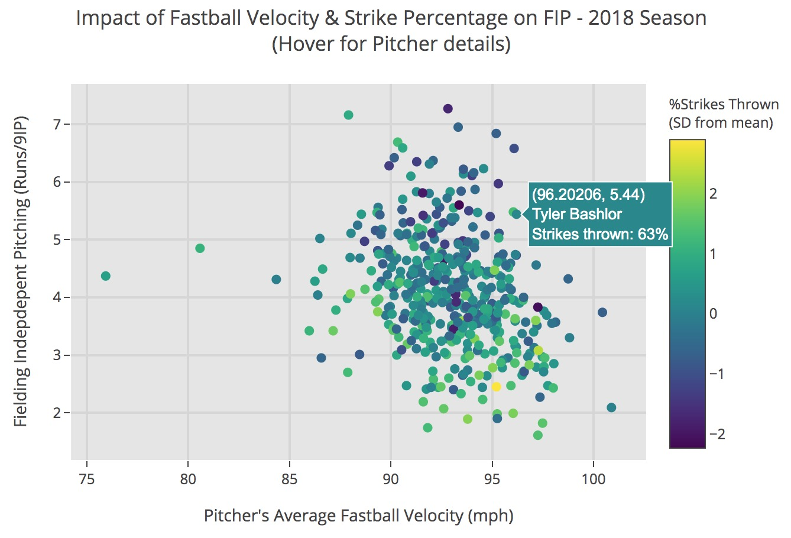
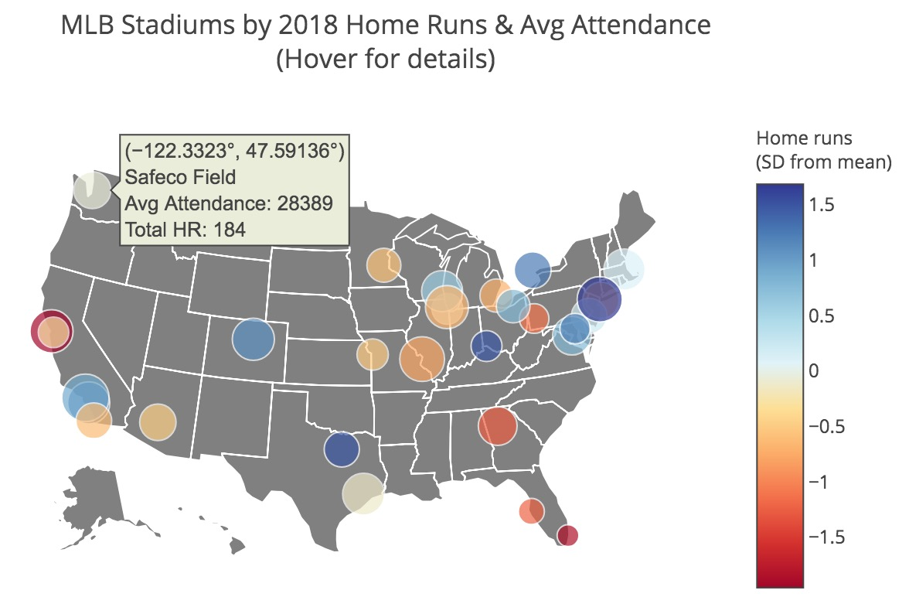

# MLB Pitch Data Visualization

## Project Description
For the final project for USF's Data Visualization course, I chose to combine two of my passions - data science and baseball - in analyzing a dataset of Major League Baseball (MLB) pitch data. My primary goals were to better understand the variety of pitches thrown in the MLB, how the different features of pitches vary, and what features make a pitch or pitcher particularly effective. To add some richness to the pitch dataset, I joined it with several additional tables including details on the game, at bat, player/stats, stadium location, etc. The majority of plots were generated using the Plotly and Matplotlib packages in Python.

## Important Links
 - [Final report](final_project_evan_calkins.pdf)
 - [Code for plots](final_project_ecalkins.ipynb)
 - [Primary data source](https://www.kaggle.com/pschale/mlb-pitch-data-20152018#pitches.csv)

## Select Plots

[^ Link to interactive version](https://plot.ly/~ecalkins/102/impact-of-fastball-velocity-strike-percentage-on-fip-2018-season)

[^ Link to interactive version](https://plot.ly/~ecalkins/106/mlb-stadiums-by-2018-home-runs-avg-attendance-hover-for-attendance-numbers)

